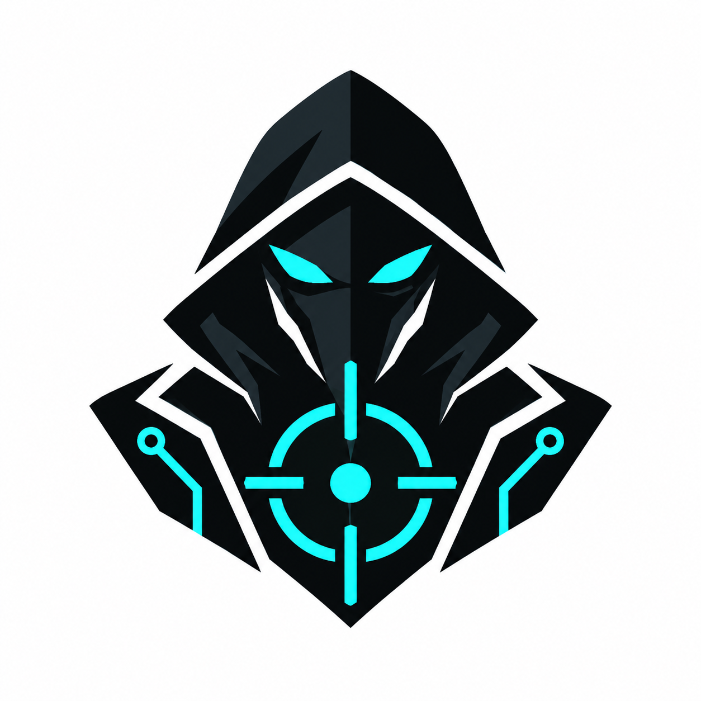

<p align="center">
  <a href="https://github.com/rfdiosuao/prize-ops"></a>
</p>

<h1 align="center">PrizeOps · 黑客松情报与实战工作流</h1>

<p align="center">发现比赛、做出作品、讲清价值，把每一次参赛变成下一次的经验。</p>

<p align="center">
  <a href="LICENSE"></a>
  <a href="events/README.md"></a>
</p>

<p align="center">
  <a href="#加入黑客松情报群">加入飞书群</a> ·
  <a href="#快速开始">运行情报雷达</a> ·
  <a href="events/README.md">赛事记录</a> ·
  <a href="reviews/README.md">实战复盘</a>
</p>

## 这是什么

给寻找比赛、组队做作品、准备路演的开发者与创作者使用的工具和方法库。既收集赛事信息，也沉淀选题、UI、演示和复盘经验。

**可以直接做的事：** 运行 HackHQ 赛事抓取脚本、阅读设计与路演模板、查看养令二等奖复盘、加入飞书群交流比赛与项目。

**需要自己配置的事：** 定时任务、飞书/邮件/短信推送以及可选模型服务。克隆仓库不会自动启动通知；外部来源的可用性和结果数量会变化。本项目不承诺获奖概率或通用评分权重。

## 加入黑客松情报群

发现了好比赛、想找队友、分享项目或交流路演经验？欢迎加入 **「黑客松通知」飞书群**。知道这个项目的朋友也可以把仓库分享给同伴，一起补充情报。

<p align="center">
  <a href="assets/feishu-hackathon-group.png"></a>
</p>

使用飞书扫码；手机浏览 GitHub 时可点开原图，保存后在飞书中识别。若无法加入，请在 [Issues](https://github.com/rfdiosuao/prize-ops/issues) 反馈。二维码为维护者提供的公开入群图片，不是支付码。

## 快速开始

先运行一个只抓取、不发送通知的最小流程。需要 Git、Python 3 和 `requests`。

```bash
git clone https://github.com/rfdiosuao/prize-ops.git
cd prize-ops
python -m pip install requests
python -X utf8 01-radar/fetch_hackathons.py
```

脚本会在 `01-radar/` 写入 `latest_all.json` 与 `latest_new.json` 并输出数量。请检查来源与截止日期；输出为零时不要直接认定没有比赛，应核对来源访问情况。

`-X utf8` 避免 Windows 默认编码无法打印赛事名称中的特殊字符。本次文档更新时已实测抓取流程，结果数量不是固定承诺。

已知限制：部分来源表格的截止日期可能被解析成其他字段；这些是原始情报，不是已核验赛历。报名之前必须查看官方页面。

抓取脚本无需先填通知密钥。需要推送或定时运行时，再阅读 [情报雷达说明](01-radar/README.md)、[配置说明](docs/CONFIGURATION.md) 和 [安装文档](docs/INSTALL.md)，按对应脚本核对配置。凭据只保存在本地，不要贴进 Issue 或提交 Git。

## 从情报到复盘

### 说“复盘”，自动贡献项目经验

安装 [prizeops-review Skill](docs/one-word-review.md) 并首次同意公开提交后，在当前项目对话里说 **“复盘”**，助手会整理可见的全流程证据，复用 `gh` 登录，通过个人 Fork 向本仓库提交 PR；重复复盘更新已有开放 PR。

```bash
gh auth login --hostname github.com
python -X utf8 07-crystal/install_review_skill.py --agent codex --enable-public-pr
```

上述开关明确启用以后“复盘”时自动公开报告。不想预先授权就去掉开关。只上传复盘 Markdown，不上传源代码、原始聊天或密钥；缺失历史不编造，未登录先保存在本地。安装后重新加载助手，详见[使用说明与关闭方法](docs/one-word-review.md)。

| 阶段 | 要解决的问题 | 从这里开始 |
|---|---|---|
| 情报雷达 | 有什么比赛，什么时候截止？ | [抓取与通知](01-radar/README.md) |
| 筛选与分析 | 适不适合我，规则要求什么？ | [进入流程](02-compass/AUTO_ENTRY.md) |
| 作品设计 | 怎样把核心价值变成可操作的 Demo？ | [最小演示流程](docs/minimum-demo-loop.md) |
| 视觉与交互 | 怎样让人看懂、用顺？ | [UI 美学](05-stage/UI_AESTHETICS.md) · [交互](05-stage/UX_INTERACTION.md) |
| 路演冲刺 | 怎样把功能讲成有依据的价值？ | [路演稿](06-sprint/ALTRUISTIC_PITCH.md) · [演示材料](06-sprint/PITCH_DECK.md) |
| 复盘沉淀 | 什么要保留，下一次先改什么？ | [复盘流程](07-crystal/README.md) · [档案](reviews/README.md) |

完整旧版方法与部署提示保存在 [工作流历史手册](WORKFLOW.md)。其中的比例、既有配置状态和规划内容不等同于当前验收结果，应以代码、实际测试与本场赛规为准。

## 最新赛事记录

| 项目 | 赛事 | 成绩 | 记录 |
|---|---|---|---|
| [养令 YangLing](https://github.com/rfdiosuao/yangling) | 复客松（团队简称，正式全称待补） | **二等奖**，参赛者确认 | [赛事档案](events/2026-09-13-yangling.md) · [完整复盘](reviews/2026-09-13-复客松-养令-二等奖复盘.md) |
| 一念成界 · Worldseed（白小纯） | Eazo 数字艺术黑客松 | **最佳世界观奖（并列）**，已有赛后记录及参赛者确认 | [赛事档案](events/2026-09-07-worldseed.md) · [赛后拆解](reviews/2026-09-07-Eazo数字艺术黑客松-获奖项目全景拆解.md) |

养令复盘的核心经验：把具体问题做成可体验的产品，再用真实演示讲清价值。尚无评委评分明细，不把某个功能或赞助方接入直接归因为获奖原因。

Worldseed 的可复用经验：把“一念成界”的概念转成可进入、可互动、可封存的世界体验。奖项是最佳世界观奖（并列），不是该场总冠军。

## 一起补充这个仓库

- **分享赛事：** 在群里交流，或提交 Issue，附官方链接、报名截止、参赛条件和查询日期。
- **提交项目：** 说明项目做什么、体验入口和实际完成情况，不上传密钥与个人敏感数据。
- **贡献复盘：** 参考 [reviews/README.md](reviews/README.md)，写清结果、证据、可复用做法与下次改进，再提交 PR。
- **报告问题：** 附运行命令、错误现象和脱敏日志，不粘贴配置里的真实凭据。

文档和工具遵循 [MIT License](LICENSE)。Logo 与飞书群图片由维护者提供；其他项目、平台名称及商标归各自权利人所有。
